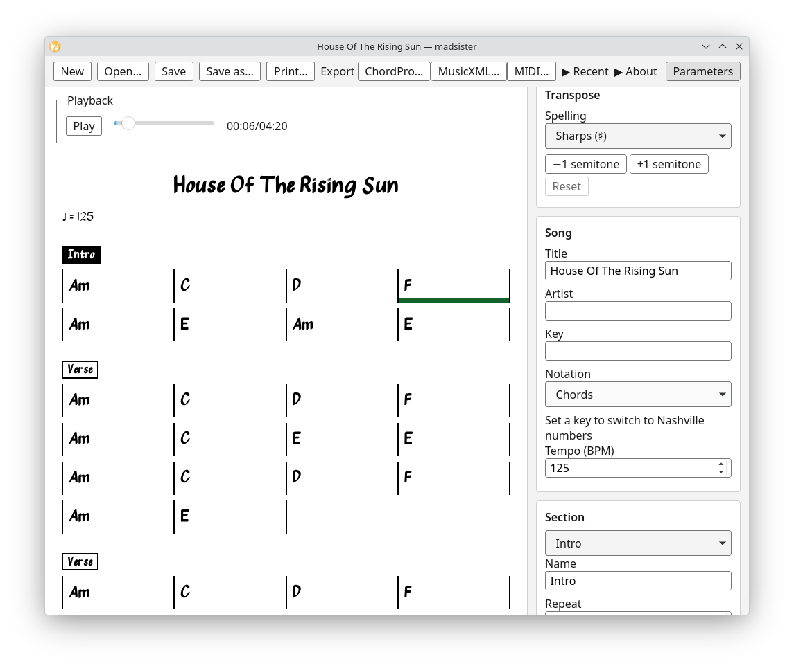

# madsister

Offline desktop app that turns a song into an editable, printable chord grid.

Give it an audio file, a URL or a recording: madsister detects the beats, the bars and the chords, and lays them out as a
musician's chart, by sections, with one or more chords per bar. Chord recognition is never perfect, so the result is a
draft: the keyboard-first editor is there to turn it into a correct chart fast, then print it or export it. Everything
runs on your machine; nothing is sent anywhere.



## Features

- Import from an audio file (or drop it on the window), a URL, or a recording of the default audio input.
- Automatic beats, downbeats and chords; meter forced to 4/4, 3/4 or 6/8 if detection gets it wrong; optional section
  detection (intro, verse, chorus…).
- Low-confidence chords are highlighted: <kbd>F8</kbd> / <kbd>Shift</kbd>+<kbd>F8</kbd> jumps from one to the next.
- Keyboard-first grid editor: type chords, split and merge slots, insert, duplicate and copy bars, fix bar lines and
  half/double tempo, split, repeat and reorder sections, undo/redo. Press <kbd>?</kbd> in the app for every shortcut.
- Playback of the source audio with a cursor on the grid; click a bar to move the playback there.
- Transposition, French (C7M), international (Cmaj7) or Latin (Sol7M) chord names, Nashville numbers, several chart fonts.
- Print (with a compact two-column layout), and export to ChordPro, MusicXML and MIDI.
- Charts are saved as plain JSON files (`*.madsister.json`).

## Quick start

1. Import a song (or start a new chart with <kbd>Ctrl</kbd>/<kbd>⌘</kbd>+<kbd>N</kbd>) and click **Run**.
2. Correct the chords: move with the arrow keys, type a chord, <kbd>Enter</kbd>.
3. Review the highlighted chords with <kbd>F8</kbd>, using playback (<kbd>Space</kbd>) to check by ear.
4. Print (<kbd>Ctrl</kbd>/<kbd>⌘</kbd>+<kbd>P</kbd>) or export.
5. Save (<kbd>Ctrl</kbd>/<kbd>⌘</kbd>+<kbd>S</kbd>).

## Install (Debian, Ubuntu)

Add the apt repository once, and `apt upgrade` then keeps madsister up to date:

```sh
sudo curl -fsSLo /etc/apt/keyrings/madsister.asc https://www.dericbourg.net/madsister/key.asc
sudo tee /etc/apt/sources.list.d/madsister.sources <<'EOF'
Types: deb
URIs: https://www.dericbourg.net/madsister
Suites: stable
Components: main
Signed-By: /etc/apt/keyrings/madsister.asc
EOF
sudo apt update && sudo apt install madsister
```

- Two packages: `madsister` follows the releases; `madsister-snapshot` follows every push to `main` (unreleased, may be
  broken). Install either or both: the snapshot has its own command (`madsister-snapshot`), launcher and data dir, so
  it never touches the stable app's settings, and it downloads its own engine.
- amd64 only. The first launch downloads the engine (Python, its libraries and the models), once, and again after an update.
- The `.deb` and the AppImage are also on the [releases page](https://github.com/adericbourg/madsister/releases).
- Uninstall: `sudo apt remove madsister` (or `madsister-snapshot`); to remove the repository, delete
  `/etc/apt/sources.list.d/madsister.sources` and `/etc/apt/keyrings/madsister.asc`.

## Install (macOS, Apple silicon)

```sh
brew tap adericbourg/tap
brew trust --tap adericbourg/tap
brew install --cask madsister
```

- `madsister-snapshot` follows every push to `main`, like the apt package, and installs next to `madsister`.
- The app isn't signed or notarized: the cask clears the quarantine flag, so Gatekeeper doesn't block it. With the `.dmg`
  from the [releases page](https://github.com/adericbourg/madsister/releases), copy the app to `/Applications` and run
  `xattr -dr com.apple.quarantine /Applications/madsister.app` once.
- Same first launch as on Linux (the engine and the models download once); ffmpeg comes with the cask.
- Uninstall: `brew uninstall --cask madsister` (`--zap` also removes the engine and the data).

## Limits

- Linux (amd64) and macOS (Apple silicon) only.
- Recognition targets pop, rock, chanson and folk harmony; jazz extensions (9, 11, 13, alterations) can be typed but
  aren't detected.
- Section detection is slow (about 6 minutes for a 4-minute song) and downloads its models on first use.
- Network access is needed only for the first launch, the first section detection and URL imports.

## License

madsister's code is GPLv3 ([LICENSE](LICENSE)). The engine includes madmom's CC BY-NC-SA 4.0 model weights, so the
application is for **non-commercial use only**; see [THIRD_PARTY.md](THIRD_PARTY.md).

## Contributing

To build, run, test or package madsister from source, see [CONTRIBUTING.md](CONTRIBUTING.md).
